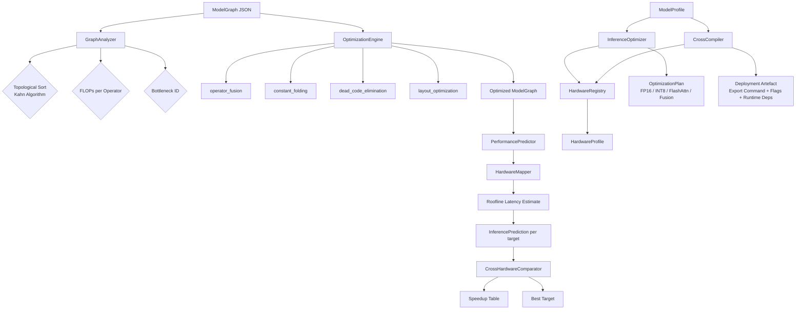

# aumai-chipbridge

Cross-hardware ML inference optimization for the AumAI ecosystem.

---

## What Is This?

Think of deploying a machine learning model like shipping a car engine overseas. The engine works perfectly in the factory, but you need to know: which ship to use, how to pack it, whether to drain the fluids, and what tools will be available on the other end. Without that knowledge, you might ship a Ferrari engine to a port that only has bicycle wrenches.

`aumai-chipbridge` is the logistics planner for your ML models. Given a description of your model's computation graph — the sequence of mathematical operations it performs — ChipBridge tells you:

- How fast that model will run on any target hardware (A100 GPU, Apple M2, ARM chip, Intel Xeon, TPU, and more)
- Which operations are the bottleneck slowing everything down
- What optimizations to apply before deploying
- What export commands, compile flags, and runtime libraries you need on the destination hardware

It does all of this analytically, using the roofline performance model — a first-principles method borrowed from computer architecture research — so you do not need to own every piece of hardware to make informed deployment decisions.

---

## Why Does This Matter?

### The Hardware Fragmentation Problem

The ML hardware landscape has never been more fragmented. A model trained on an A100 GPU might be deployed to:

- A cloud NVIDIA T4 (inference cost optimization)
- An Apple M2 chip (edge deployment on macOS)
- An ARM Cortex CPU (mobile or IoT)
- A Google TPU pod (high-throughput serving)
- An Intel Xeon with AVX-512 (on-premise enterprise)

Each of these has completely different memory bandwidth, compute throughput, precision support, and preferred data layouts. Running the same unoptimized model across all of them yields wildly different latency — often 10x to 100x differences.

### The Roofline Model — From First Principles

Every operator in a neural network is limited by one of two resources:

1. **Compute throughput** — how many floating-point operations per second the chip can execute (TFLOPS)
2. **Memory bandwidth** — how fast data can move between memory and compute units (GB/s)

The roofline model plots arithmetic intensity (FLOPs per byte of memory traffic) against these two limits. If an operator needs relatively few bytes per FLOP — like a large matrix multiply — it is compute-bound. If it needs many bytes per FLOP — like layer normalization or embedding lookup — it is memory-bound.

ChipBridge applies this model to each operator in your graph, against each target's measured specifications, to predict latency analytically — without executing a single inference.

```
Performance (TFLOPS)
      |           /  <- compute roofline
      |          /
      |         /   <- memory-bound region (below the ridge)
      |        /
      |-------/-------  compute-bound region (above the ridge)
      |
      +-------------------> Arithmetic Intensity (FLOP/byte)
                  ^
            ridge point
```

---

## Architecture



---

## Features

- **Graph analysis**: Topological sort (Kahn's algorithm), per-operator FLOPs estimation, bottleneck identification using the roofline model
- **Hardware profiles**: Built-in accurate specs for A100, T4, M2, Xeon, ARM, GPU CUDA/ROCm, TPU, NPU, CPU x86/ARM — 11 targets total
- **Operator implementation mapping**: Maps each `OperatorType` to its best hardware-native implementation (cuBLAS, cuDNN, FlashAttention v2, MKL AVX-512, ARM Compute Library, Apple Accelerate BLAS, XLA, TFLite INT8, OpenVINO)
- **Latency prediction**: Roofline-model-based analytical prediction per operator with compute vs. memory bound classification — no hardware required
- **Cross-hardware comparison**: Compare all targets in one call, get speedup tables relative to any baseline target
- **Optimization passes**: `operator_fusion`, `constant_folding`, `dead_code_elimination`, `layout_optimization` (NCHW/NHWC)
- **Inference optimization plans**: Precision recommendations (FP32/FP16/INT8), Flash Attention eligibility, kernel fusion, INT8 quantization warnings when model exceeds device memory
- **Cross-compilation artefacts**: Framework-specific export commands, compile flags, and runtime library requirements for each target
- **Custom hardware registration**: Add your own `HardwareProfile` to `HardwareRegistry`
- **CLI tools**: `analyze`, `optimize`, `predict`, `compare` — all work with a built-in demo transformer graph or your own JSON file
- **Pydantic v2 models**: Full runtime validation at every system boundary

---

## Quick Start

### Installation

```bash
pip install aumai-chipbridge
```

### CLI — Instant Demo (No Files Required)

```bash
# Analyze the built-in demo transformer graph on a CUDA GPU
aumai-chipbridge analyze --target gpu_cuda

# Predict latency on a TPU
aumai-chipbridge predict --target tpu

# Compare all hardware targets, baseline = CPU x86
aumai-chipbridge compare

# Apply optimization passes and save result
aumai-chipbridge optimize --target a100 --passes operator_fusion,layout_optimization --output optimized.json
```

### CLI — Your Own Model Graph

```bash
aumai-chipbridge analyze --graph my_model.json --target a100
aumai-chipbridge predict --graph my_model.json --target m2
aumai-chipbridge optimize --graph my_model.json --target xeon --passes operator_fusion,constant_folding
aumai-chipbridge compare --graph my_model.json --baseline t4
```

### Python — Five Lines

```python
from aumai_chipbridge import (
    ModelGraph, GraphOperator, OperatorType,
    PerformancePredictor, HardwareTarget,
)

graph = ModelGraph(
    name="my_model",
    operators=[
        GraphOperator(
            op_id="matmul_0",
            op_type=OperatorType.MATMUL,
            input_shapes=[(128, 768)],
            output_shape=(128, 3072),
        ),
    ],
    edges=[],
)

predictor = PerformancePredictor()
prediction = predictor.predict(graph, HardwareTarget.A100)
print(f"Latency on A100: {prediction.total_latency_ms:.4f} ms")
```

---

## Full CLI Reference

### `aumai-chipbridge analyze`

Analyze a model graph: FLOPs, topological execution order, and bottleneck operator identification.

```
Options:
  --graph PATH     Path to ModelGraph JSON file. Uses built-in demo graph if omitted.
  --target TEXT    Hardware target for bottleneck analysis.
                   Choices: cpu_x86, cpu_arm, gpu_cuda, gpu_rocm, tpu, npu,
                            a100, t4, m2, xeon, arm
                   Default: gpu_cuda
  --version        Show version and exit.
  --help           Show help message and exit.
```

**Example output:**
```
Model Graph: demo_transformer
Operators  : 8
Edges      : 7
Total FLOPs: 4,756,373,504
Target     : gpu_cuda
Bottleneck : attn_0

Execution Order (topological):
  embed                          98,304 FLOPs
  attn_0             4,697,620,480 FLOPs <-- BOTTLENECK
  norm_0                    491,520 FLOPs
  ff_0                    50,331,648 FLOPs
  gelu_0                  3,932,160 FLOPs
  ff_1                      786,432 FLOPs
  norm_1                    393,216 FLOPs
  softmax_out             4,915,200 FLOPs
```

---

### `aumai-chipbridge optimize`

Apply graph optimization passes and optionally save the optimized graph to a JSON file.

```
Options:
  --graph PATH       Path to ModelGraph JSON file. Uses demo graph if omitted.
  --target TEXT      Hardware target (same choices as analyze). Default: gpu_cuda.
  --passes TEXT      Comma-separated list of pass names to apply.
                     Available: operator_fusion, constant_folding,
                                dead_code_elimination, layout_optimization
                     If omitted, all applicable passes for the target are applied.
  --output PATH      Write optimized graph JSON to this path.
                     Prints operator list to stdout if omitted.
  --help             Show help message and exit.
```

---

### `aumai-chipbridge predict`

Predict inference latency with a full per-operator breakdown and roofline bound classification.

```
Options:
  --graph PATH     Path to ModelGraph JSON file. Uses demo graph if omitted.
  --target TEXT    Hardware target. Default: gpu_cuda.
  --help           Show help message and exit.
```

**Example output:**
```
Performance Prediction: demo_transformer on tpu
Total latency: 0.0721 ms
Bottleneck   : attn_0

Per-Operator Breakdown:
  Op ID                    Latency (ms)      Bound           FLOPs
  --------------------------------------------------------------------
  attn_0                       0.067108    compute  4,697,620,480
  ff_0                         0.000716    compute     50,331,648
  softmax_out                  0.000070    compute      4,915,200
```

---

### `aumai-chipbridge compare`

Compare latency and speedup across all registered hardware targets.

```
Options:
  --graph PATH      Path to ModelGraph JSON file. Uses demo graph if omitted.
  --baseline TEXT   Hardware target to use as the speedup baseline.
                    Default: cpu_x86.
  --help            Show help message and exit.
```

**Example output:**
```
Cross-Hardware Comparison: demo_transformer
Baseline: cpu_x86
Best target: a100

  Target           Latency (ms)    Speedup vs baseline
  ----------------------------------------------------
  a100                   0.0455            1523.08x (*)
  tpu                    0.0721             961.28x
  gpu_cuda               0.2540             272.85x
  gpu_rocm               0.3175             218.28x
  t4                     0.5321             130.08x
  m2                     1.1200              61.82x
  xeon                  18.2400               3.79x
  arm                   39.4100               1.75x
  cpu_x86               69.0100               1.00x
```

---

## Python API Examples

### Building a Model Graph Programmatically

```python
from aumai_chipbridge import ModelGraph, GraphOperator, OperatorType

# A minimal BERT-style transformer layer
ops = [
    GraphOperator(
        op_id="embed",
        op_type=OperatorType.EMBEDDING,
        input_shapes=[(1, 128)],
        output_shape=(1, 128, 768),
        attributes={"embed_dim": 768, "vocab_size": 30522},
    ),
    GraphOperator(
        op_id="attn",
        op_type=OperatorType.ATTENTION,
        input_shapes=[(1, 128, 768)],
        output_shape=(1, 128, 768),
        attributes={"num_heads": 12},
    ),
    GraphOperator(
        op_id="norm",
        op_type=OperatorType.LAYERNORM,
        input_shapes=[(1, 128, 768)],
        output_shape=(1, 128, 768),
    ),
    GraphOperator(
        op_id="ff",
        op_type=OperatorType.MATMUL,
        input_shapes=[(128, 768)],
        output_shape=(128, 3072),
    ),
    GraphOperator(
        op_id="gelu",
        op_type=OperatorType.GELU,
        input_shapes=[(128, 3072)],
        output_shape=(128, 3072),
    ),
]

graph = ModelGraph(
    name="bert_layer",
    operators=ops,
    edges=[("embed", "attn"), ("attn", "norm"), ("norm", "ff"), ("ff", "gelu")],
)
```

### Predicting Latency Across Multiple Targets

```python
from aumai_chipbridge import PerformancePredictor, HardwareTarget

predictor = PerformancePredictor()

for target in [HardwareTarget.A100, HardwareTarget.T4, HardwareTarget.M2, HardwareTarget.XEON]:
    pred = predictor.predict(graph, target)
    print(
        f"{target.value:10s}: {pred.total_latency_ms:.4f} ms  "
        f"bottleneck={pred.bottleneck_op_id}"
    )
```

### Cross-Hardware Comparison and Speedup Table

```python
from aumai_chipbridge import CrossHardwareComparator, HardwareTarget

comparator = CrossHardwareComparator()

# Compare a subset of targets
comparison = comparator.compare(graph, targets=[
    HardwareTarget.A100, HardwareTarget.T4, HardwareTarget.XEON, HardwareTarget.M2,
])

# Find the fastest target
best = comparator.best_target(graph)
print(f"Best hardware: {best.value}")

# Speedup table relative to baseline CPU
speedups = comparator.speedup_table(graph, baseline=HardwareTarget.CPU_X86)
for target_id, speedup in sorted(speedups.items(), key=lambda x: -x[1]):
    print(f"  {target_id}: {speedup:.1f}x")
```

### Applying Optimization Passes

```python
from aumai_chipbridge import OptimizationEngine, HardwareTarget

engine = OptimizationEngine()

# List passes available for a specific target
passes = engine.list_passes(HardwareTarget.A100)
for p in passes:
    print(f"{p.name}: {p.description}")

# Apply all applicable passes
optimized_graph, applied = engine.optimize(graph, HardwareTarget.A100)
print(f"Applied passes: {applied}")
print(f"Operators before: {len(graph.operators)}, after: {len(optimized_graph.operators)}")

# Apply specific passes only
optimized_graph, applied = engine.optimize(
    graph,
    HardwareTarget.A100,
    passes=["operator_fusion", "layout_optimization"],
)
```

### Generating an Optimization Plan

```python
from aumai_chipbridge.core import InferenceOptimizer
from aumai_chipbridge.models import ModelProfile

model = ModelProfile(
    model_name="llama-7b",
    parameter_count=7_000_000_000,
    flops_per_inference=14e12,         # 14 TFLOP per forward pass
    memory_footprint_mb=14_000,        # 14 GB for FP32 weights
    has_attention=True,
    has_convolutions=False,
)

optimizer = InferenceOptimizer()
plan = optimizer.analyze(model, "a100")

print(f"Precision recommendation: {plan.precision_recommendation}")
print(f"Recommended techniques: {plan.recommended_techniques}")
print(f"Expected speedup: {plan.expected_speedup}x")
print(f"Estimated latency: {plan.estimated_latency_ms:.2f} ms")
print(f"Estimated throughput: {plan.estimated_throughput_qps:.1f} QPS")
print(f"Memory reduction: {plan.expected_memory_reduction * 100:.0f}%")
for warning in plan.warnings:
    print(f"WARNING: {warning}")
```

### Generating Cross-Compilation Artefacts

```python
from aumai_chipbridge.core import CrossCompiler
from aumai_chipbridge.models import ModelProfile

model = ModelProfile(
    model_name="resnet50",
    parameter_count=25_000_000,
    flops_per_inference=4e9,
    memory_footprint_mb=100,
    has_convolutions=True,
)

compiler = CrossCompiler()

for target_id in ["a100", "m2", "xeon", "arm"]:
    artefact = compiler.compile(model, target_id)
    print(f"\n--- {target_id} ---")
    print(f"  Export: {artefact['export_command']}")
    print(f"  Flags:  {artefact['compile_flags']}")
    print(f"  Deps:   {artefact['runtime_requirements']}")
    print(f"  Fits in device memory: {artefact['fits_in_device_memory']}")
```

### Working with the Hardware Registry

```python
from aumai_chipbridge.core import HardwareRegistry
from aumai_chipbridge.models import HardwareProfile, HardwareTarget

registry = HardwareRegistry()

# List all built-in target IDs
print(registry.list_targets())
# ['a100', 'arm', 'cpu_arm', 'cpu_x86', 'gpu_cuda', 'gpu_rocm', 'm2', 'npu', 't4', 'tpu', 'xeon']

# Retrieve a specific profile
profile = registry.get("a100")
print(f"A100: {profile.compute_tflops} TFLOPS FP32, {profile.memory_bandwidth_gbps} GB/s")
print(f"Architecture: {profile.architecture}")
print(f"Tensor cores: {profile.has_tensor_cores}")

# Register a custom hardware target
custom_npu = HardwareProfile(
    target=HardwareTarget.NPU,
    compute_tflops=6.0,
    memory_bandwidth_gbps=180.0,
    memory_capacity_gb=8.0,
    has_tensor_cores=False,
    supports_fp16=True,
    supports_int8=True,
    architecture="custom_npu_v3",
    notes="In-house NPU with dedicated INT8 accelerator",
)
registry.register(custom_npu)
```

---

## ModelGraph JSON Format

You can load a `ModelGraph` from a JSON file using the CLI `--graph` flag. The format mirrors the `ModelGraph` Pydantic model exactly:

```json
{
  "name": "my_bert",
  "operators": [
    {
      "op_id": "embed",
      "op_type": "embedding",
      "input_shapes": [[1, 128]],
      "output_shape": [1, 128, 768],
      "attributes": {"embed_dim": 768, "vocab_size": 30522}
    },
    {
      "op_id": "attn_0",
      "op_type": "attention",
      "input_shapes": [[1, 128, 768]],
      "output_shape": [1, 128, 768],
      "attributes": {"num_heads": 12}
    },
    {
      "op_id": "ff_0",
      "op_type": "matmul",
      "input_shapes": [[128, 768]],
      "output_shape": [128, 3072],
      "attributes": {}
    }
  ],
  "edges": [
    ["embed", "attn_0"],
    ["attn_0", "ff_0"]
  ]
}
```

Valid `op_type` values: `conv2d`, `matmul`, `attention`, `layernorm`, `softmax`, `gelu`, `embedding`

---

## Configuration

ChipBridge has no configuration files. All settings are passed through Python objects or CLI flags. Hardware profiles are defined as constants in `core.py` and extended via `HardwareRegistry.register()`.

### Dependencies

- Python 3.11+
- `pydantic >= 2.0` — model validation
- `click >= 8.0` — CLI framework

---

## Technical Deep Dive

### FLOPs Estimation Per Operator Type

| Operator    | FLOPs Formula                                              |
|-------------|------------------------------------------------------------|
| `MATMUL`    | `2 * M * K * N`                                            |
| `CONV2D`    | `2 * B * C_out * H * W * C_in * kernel_h * kernel_w`      |
| `ATTENTION` | `4 * B * seq_len * seq_len * d_model`                      |
| `LAYERNORM` | `5 * total_elements`                                       |
| `SOFTMAX`   | `5 * total_elements`                                       |
| `GELU`      | `5 * total_elements`                                       |
| `EMBEDDING` | `B * seq_len * embed_dim`                                  |

### Roofline Latency Prediction

```
arithmetic_intensity = FLOPs / memory_bytes
ridge_point          = compute_tflops / memory_bandwidth_gbps

if arithmetic_intensity >= ridge_point:
    raw_latency = FLOPs / (compute_tflops * 1e12)   # compute bound
else:
    raw_latency = memory_bytes / (bandwidth * 1e9)  # memory bound

final_latency_ms = (raw_latency / speedup_multiplier) * 1000
```

The `speedup_multiplier` in `HardwareMapper._SPEEDUP_TABLE` accounts for hardware-specific acceleration. For example, the A100 has a 155x speedup multiplier on `MATMUL` (vs. scalar CPU baseline) reflecting cuBLAS tensor core throughput.

### Optimization Passes Summary

| Pass                      | What it does                                                    | GPU only |
|---------------------------|-----------------------------------------------------------------|----------|
| `operator_fusion`         | Fuses consecutive MATMUL + LAYERNORM pairs into a single op     | No       |
| `constant_folding`        | Removes isolated operators not connected to any other node      | No       |
| `dead_code_elimination`   | Removes terminal operators whose output is never consumed       | No       |
| `layout_optimization`     | Sets `preferred_layout` attribute on CONV2D ops (NHWC/NCHW)     | Yes      |

### Hardware Profiles — Key Specifications

| Target    | Compute (TFLOPS FP32) | Bandwidth (GB/s) | Memory (GB) | Tensor Cores |
|-----------|-----------------------|------------------|-------------|--------------|
| A100      | 77.6                  | 2000             | 80          | Yes          |
| TPU       | 45.0                  | 600              | 8           | Yes          |
| GPU CUDA  | 10.0                  | 900              | 24          | Yes          |
| T4        | 8.1                   | 300              | 16          | Yes          |
| GPU ROCm  | 8.0                   | 700              | 16          | Yes          |
| M2        | 3.6                   | 100              | 24          | No           |
| NPU       | 2.0                   | 100              | 2           | No           |
| Xeon      | 1.0                   | 204.8            | 512         | No           |
| ARM       | 0.5                   | 51.2             | 16          | No           |
| CPU x86   | 0.5                   | 50.0             | 16          | No           |
| CPU ARM   | 0.3                   | 40.0             | 8           | No           |

---

## Integration with Other AumAI Projects

- **aumai-omnipercept**: Use ChipBridge to select the optimal inference hardware for OmniPercept perception pipelines before deploying them
- **aumai-specs**: ChipBridge's `HardwareProfile` and `ModelProfile` are Pydantic v2 models compatible with the AumAI specs validation framework
- **aumai-routercore**: Route inference requests to the hardware target identified as optimal by `CrossHardwareComparator.best_target()`
- **aumai-traceweave**: Feed ChipBridge's `InferencePrediction` per-operator timings as synthetic trace spans for performance monitoring dashboards

---

## License

Apache 2.0. See `LICENSE` for details.

**Disclaimer**: This library provides analytical estimates based on published hardware specifications and simplified performance models. Actual inference latency on real hardware will vary based on driver versions, thermal throttling, memory fragmentation, batch size variability, concurrent workloads, and other runtime factors. Always validate predictions with real hardware benchmarks before making production hardware purchasing or deployment decisions.
